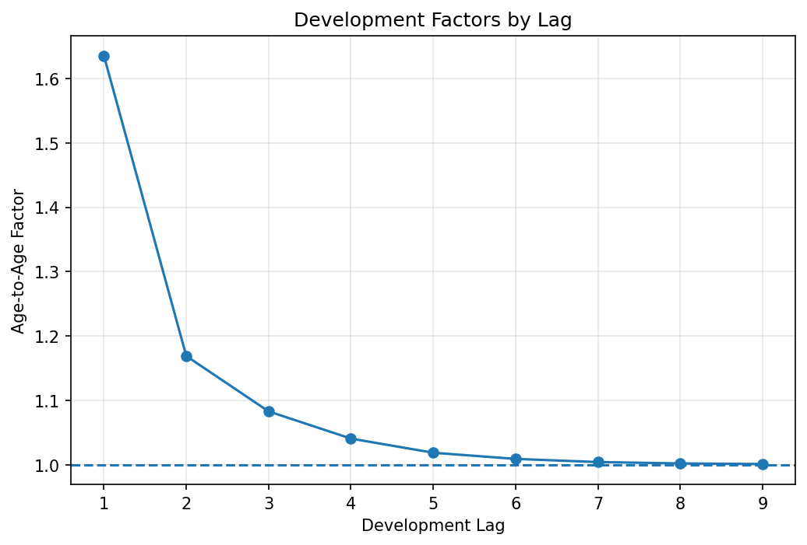

# Loss Reserving — Chain-Ladder

Chain-ladder reserving on a US personal auto portfolio, implemented from scratch in pandas, validated against `chainladder-python` and backtested against nine years of subsequent development.

**Reserve estimate: $13.12M** as at year-end 2007. Against what the company actually paid out through 2016, the projection came within **0.29%** — systematically light, for a reason worth explaining below.

## Data

CAS Loss Reserve Database (US Schedule P), private passenger auto. State Farm Mutual Group, accident years 1998–2007, cumulative paid losses, valued at year-end 2007.

- **One company, not the industry aggregate** — chain-ladder assumes a stable development pattern, which an industry blend doesn't have.
- **Paid, not incurred** — incurred losses *fall* over time here as case reserves are released, producing link ratios below 1.0.
- **Cut at the 2007 valuation** — the raw dataset is a full square including actuals through 2016. Filtering recreates the real forecasting problem; the discarded portion becomes the backtest.



| Lag | 1 | 2 | 3 | 4 | 5 | 6 | 7 | 8 | 9 |
|---|---|---|---|---|---|---|---|---|---|
| LDF | 1.6348 | 1.1692 | 1.0833 | 1.0411 | 1.0192 | 1.0096 | 1.0047 | 1.0026 | 1.0017 |

## Results

| Accident year | Latest paid | CDF | Ultimate | Reserve |
|---|---|---|---|---|
| 1998 | 10,012,517 | 1.0000 | 10,012,517 | 0 |
| 1999 | 10,283,286 | 1.0017 | 10,300,526 | 17,240 |
| 2000 | 10,981,123 | 1.0043 | 11,027,863 | 46,740 |
| 2001 | 11,837,901 | 1.0090 | 11,944,519 | 106,618 |
| 2002 | 12,490,512 | 1.0187 | 12,724,111 | 233,599 |
| 2003 | 11,561,287 | 1.0382 | 12,003,351 | 442,064 |
| 2004 | 10,710,159 | 1.0809 | 11,576,911 | 866,752 |
| 2005 | 9,772,146 | 1.1710 | 11,442,979 | 1,670,833 |
| 2006 | 8,386,582 | 1.3691 | 11,482,102 | 3,095,520 |
| 2007 | 5,365,237 | 2.2382 | 12,008,367 | 6,643,130 |
| **Total** | | | **114,523,246** | **13,122,496** |

Half the reserve sits on accident year 2007, which has one data point behind it.

## Validation

**Against the library.** Identical ultimates to `chainladder-python` — maximum difference across all ten years is zero. Asserted in `tests/test_chainladder.py`.

**Against reality.** The dataset contains actual development through 2016, so the projections can be checked at lag 10:

| Accident year | Actual | Estimated | Difference | Error |
|---|---|---|---|---|
| 1998 | 10,012,517 | 10,012,517 | 0 | 0.00% |
| 1999 | 10,305,664 | 10,300,526 | 5,138 | 0.05% |
| 2000 | 11,033,560 | 11,027,863 | 5,697 | 0.05% |
| 2001 | 11,953,731 | 11,944,519 | 9,212 | 0.08% |
| 2002 | 12,738,347 | 12,724,111 | 14,236 | 0.11% |
| 2003 | 12,057,898 | 12,003,351 | 54,547 | 0.45% |
| 2004 | 11,630,041 | 11,576,911 | 53,130 | 0.46% |
| 2005 | 11,511,377 | 11,442,979 | 68,398 | 0.59% |
| 2006 | 11,554,417 | 11,482,102 | 72,315 | 0.63% |
| 2007 | 12,061,902 | 12,008,367 | 53,535 | 0.44% |
| **Total** | **114,859,454** | **114,523,246** | **336,208** | **0.29%** |

On the reserve itself: **13,122,496** estimated against **13,458,704** actually required — **2.5% deficient**.

The pattern matters more than the headline. Every accident year is under-projected; not one overshoots. That is systematic bias, not noise, and the error scales with immaturity — mature years land within 0.1%, the least developed miss by ~0.6%. The cause is that the later factors rest on very few observations: `f_9` is estimated from accident year 1998 alone, and it understates what later years went on to show. The comparison is made at lag 10, so it excludes development beyond the triangle; since `f_9` is still 1.0017, the true deficiency is somewhat worse.

## Limitations

- **No tail factor.** The CDF beyond lag 10 is taken as 1.0 — accident year 1998 treated as fully developed. `f_9` = 1.0017 shows that isn't quite true.
- **Accident year 2007 is highly leveraged** — one data point × a CDF of 2.24, carrying half the total reserve.
- Chain-ladder degrades when claims-handling speed changes, when a single large loss distorts a cell, or when case-reserving strength shifts.
- Bornhuetter-Ferguson would address the leverage on immature years by blending in an a-priori expectation. Not implemented here.

## Running it

```bash
pip install -r requirements.txt
python main.py     # triangle, reserves, backtest, plot
pytest             # validates against chainladder-python
```

Data is committed, so the repo runs as cloned.

```
├── data/ppauto.csv
├── outputs/development_factors.png
├── src/
│   ├── triangle.py               # raw records → cumulative triangle
│   ├── vol_weighted_factors.py   # age-to-age factors
│   ├── cumulative_dev_factors.py # CDFs
│   ├── chain_ladder.py           # ultimates and reserves
│   ├── backtest.py               # projections vs actual development
│   └── plots.py
├── tests/test_chainladder.py
└── main.py
```